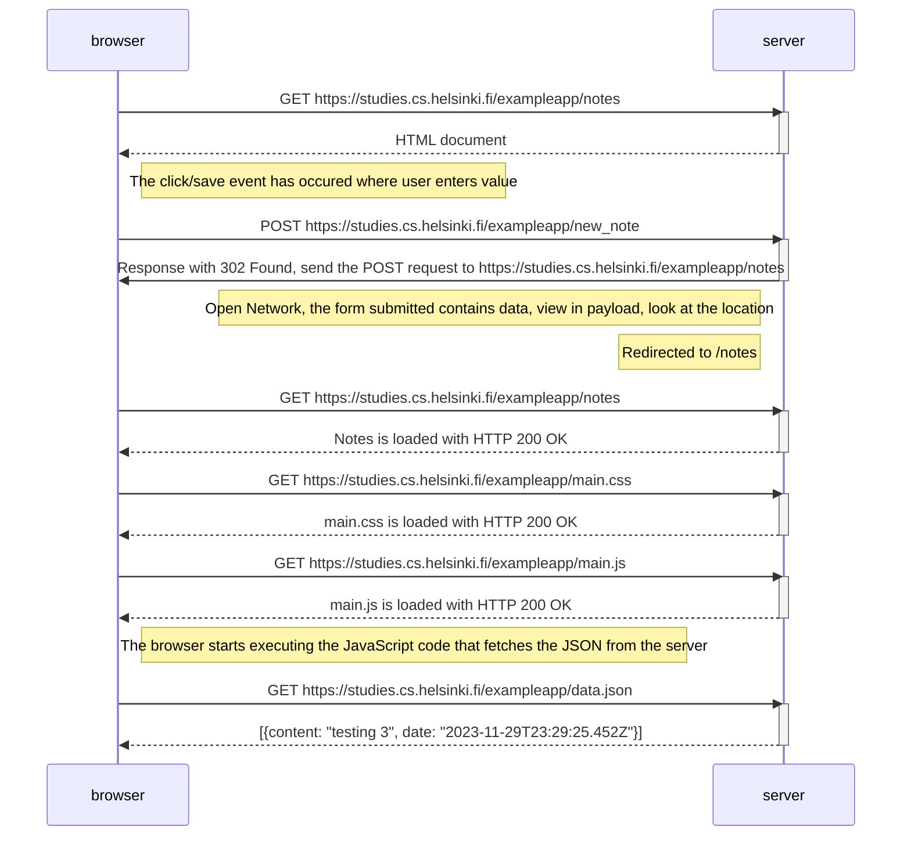

## Description of what we are trying to establish
The Notes page gives some of the responsibility, generating the HTML code for existing notes, to the browser. The browser tackles this task by executing the JavaScript code it fetched from the server. The code fetches the notes from the server as JSON data and adds HTML elements for displaying the notes to the page using the DOM-API.

> The 302 code says that the resource has been moved to a different location, this is caused by the web server and impacts user experience, the redirect happens automatically.