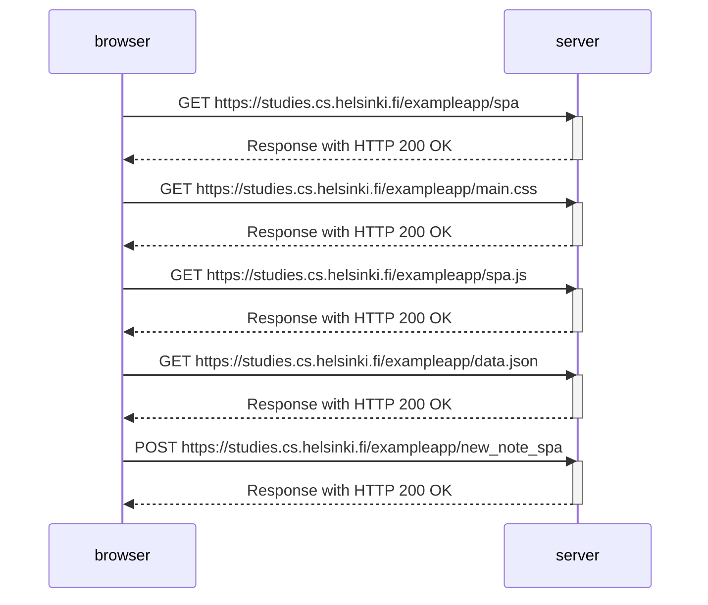

## Description of what we are trying to establish
SPA-style websites don't fetch all of their pages separately from the server like our sample application does, but instead comprise only one HTML page fetched from the server, the contents of which are manipulated with JavaScript that executes in the browser.

> The 302 code says that the resource has been moved to a different location, this is caused by the web server and impacts user experience, the redirect happens automatically.